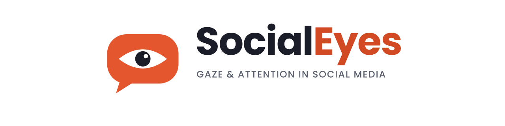
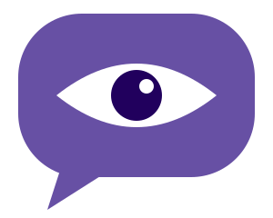

<div align="center">

<picture>
  <source media="(prefers-color-scheme: dark)" srcset="docs/assets/readme-banner-dark.png">
  <source media="(prefers-color-scheme: light)" srcset="docs/assets/readme-banner-light.png">
  
</picture>

**A controllable mock social media feed + eye tracking, for body-image research.**


[How it works](#how-it-works) ·
[Status](#feature-status) ·
[Install](#installation) ·
[Design a study](#designing-a-study) ·
[AOIs](#defining-areas-of-interest-aois) ·
[Hardware](#eye-tracking-hardware-setup) ·
[Roadmap](#roadmap)

</div>

<br>

> [!WARNING]
> **Work in progress (v0.1).** The study-definition format, the
> counterbalancing logic and the eye-tracking building blocks exist. The phone
> app and the end-to-end analysis pipeline are **not built yet**. Each part
> below is marked ✅ working, 🟡 partial or ⏳ planned, so you know what you can
> rely on today. Feedback from other labs is very welcome.

##  What is SocialEyes?

SocialEyes is an open toolkit for running **experiments on social media and
body image** in a controlled but realistic setting. Participants scroll an
Instagram-style feed on a real phone. The researcher decides exactly what is in
that feed: which images are edited, which carry a disclaimer label, what the
comments and like counts say, and in what order everything appears. While they
scroll, participants wear **Pupil Labs Neon** eye-tracking glasses, and
SocialEyes maps their gaze onto the regions of each image (face, waist, legs,
...).

<table>
<tr>
<td width="33%" valign="top">

### 🎛️ Manipulate
Swap image versions, add "edited" labels, change comments, captions and like
counts, all from one `study.yaml`.

</td>
<td width="33%" valign="top">

### ⚖️ Counterbalance
Latin-square rotation, blocked randomisation and constrained feed shuffling,
seeded so every plan is reproducible.

</td>
<td width="33%" valign="top">

### 👁️ Measure
AprilTags + an on-screen sync code map Neon gaze onto exact image regions, ready
for mixed models in R.

</td>
</tr>
</table>

**Typical questions it is built to answer:**

- Do people look longer at bodies in retouched images than in unedited ones?
- Does a "this image has been edited" label change where people look, how they
  rate the image, or their own body satisfaction afterwards?
- Do appearance-focused comments pull attention towards specific body regions?
- Can people later tell whether they saw the edited or the original version?

---

## How it works

```
 study.yaml + CSVs + images            (you write these)
          │
          ▼
 ┌─────────────────────┐   per-participant plans (feed order, conditions)
 │  study compiler     │──────────────────────────────────────────────┐
 │  (Python)           │                                              ▼
 └─────────────────────┘                                   ┌────────────────────┐
                                                           │ "Pictogram" app    │
   Neon glasses ◄──── starts/stops recording, syncs ──────►│ (Android phone)    │
        │                                                  └────────────────────┘
        │ scene video + gaze                                         │ event log
        ▼                                                            ▼
 ┌──────────────────────────────────────────────────────────────────────────────┐
 │ analysis (Python): detect AprilTags → map gaze to screen → map to post/image │
 │ → label AOIs → fixations/dwell per AOI per condition                         │
 └──────────────────────────────────────────────────────────────────────────────┘
        │ tidy CSVs
        ▼
 mixed-effects models in R (lme4 / lmerTest / emmeans / ordinal)
```

1. **You describe the study** in a `study.yaml` file next to CSVs listing the
   fake accounts, images, posts and comments.
2. **The compiler** validates it, builds the counterbalancing and writes a
   reproducible plan for every participant: which condition each critical post
   is in, and the feed order.
3. **The phone app** ("Pictogram", a neutral name so we don't use any real
   platform's trademark) runs the procedure: instructions, calibration,
   questionnaires, the feed, ratings and a recognition test. It logs every
   scroll, dwell, like and tap with timestamps.
4. **Neon glasses** record the scene camera and gaze. AprilTag markers on the
   phone case and a small flickering **sync patch** on screen let us map gaze
   onto exact screen pixels and line up the two clocks to within one video
   frame.
5. **Analysis** turns gaze into per-post, per-AOI measures (dwell time,
   fixation count, time to first fixation) and exports tidy tables for R.

---

## Feature status

| Component | Status | Where |
|---|---|---|
| Study definition schema (`study.yaml`) with validation | ✅ | `python/src/socialeyes/study/schema.py` |
| Counterbalancing (Latin square), blocked randomisation, constrained feed shuffling | ✅ | `python/src/socialeyes/study/design.py` |
| AOI loading (native JSON and LabelMe), point-in-AOI labelling | ✅ | `python/src/socialeyes/study/aoi.py` |
| AprilTag generation/detection, printable phone-case marker sheet | ✅ | `python/src/socialeyes/markers.py` |
| Sync code (m-sequence) and validation dot layouts | ✅ | `design.py` |
| Toolchain setup script (Windows) | ✅ | `scripts/setup-toolchain.ps1` |
| `socialeyes` command-line tool | ⏳ | declared in `pyproject.toml`, not written |
| Study compiler (CSV loading, cross-checks, plan export) | ⏳ | |
| Android "Pictogram" app | ⏳ | `android/` |
| Neon integration (auto start/stop, clock sync) | ⏳ | |
| Gaze-to-screen mapping and AOI analysis | ⏳ | |
| R analysis templates | ⏳ | |
| Example study, tests, `docs/STUDY_DESIGN.md` | ⏳ | |
| macOS/Linux setup script | ⏳ | the conda environment already works cross-platform |

---

## Installation

Everything installs into a **project-local `.toolchain\` folder**. Nothing is
installed system-wide, and deleting that folder removes it all.

### Requirements

- Windows 10/11 (macOS/Linux: see below)
- [Miniforge](https://github.com/conda-forge/miniforge) or Anaconda (`conda` on your PATH)
- About 6 GB of free disk space
- Git

### Steps (Windows, PowerShell)

```powershell
git clone <this repository> SocialEyes
cd SocialEyes

# One-off: creates .toolchain\env (Python 3.12, JDK 17, R 4.4 + lme4 etc.)
# and .toolchain\android-sdk. Takes 10-30 minutes. Safe to re-run.
.\scripts\setup-toolchain.ps1

# In every new PowerShell window where you work on the project:
. .\scripts\env.ps1
```

Options:

- `-SkipAndroid`: only the analysis tools (Python + R), no Android SDK. Use this
  if you only analyse data, or if you prefer Android Studio.
- `-SkipConda`: only the Android SDK.

> [!NOTE]
> The setup script accepts the Android SDK licences for you. They are printed
> to the console if you want to read them.

If PowerShell refuses to run the script, allow local scripts for your user once:
`Set-ExecutionPolicy -Scope CurrentUser RemoteSigned`.

### macOS / Linux

There is no shell script yet, but the environment file is cross-platform:

```bash
conda env create -p ./.toolchain/env -f environment.yml
conda activate ./.toolchain/env
```

### Check that it worked

```powershell
. .\scripts\env.ps1
python -c "import socialeyes, cv2; print('socialeyes', socialeyes.__version__, '| opencv', cv2.__version__)"
Rscript -e "library(lme4); cat('lme4 OK\n')"
java -version
```

---

## Designing a study

> [!NOTE]
> The format below is implemented and validated (`schema.py`). The compiler that
> reads it end to end is **not written yet**, but the format is stable enough
> to start preparing materials.

A study is a folder:

```
studies/my_study/
  study.yaml       # design, procedure, settings
  accounts.csv     # fake poster accounts (name, avatar, ...)
  images.csv       # every image file, including all edited/unedited versions
  posts.csv        # which posts exist; which are critical vs. filler
  comments.csv     # comment sets that can be attached to posts
  images/          # the image files
  aois/            # one AOI file per image (see below)
```

The column layout of the CSVs is still being finalised and will be documented
in `docs/STUDY_DESIGN.md`.

### Key ideas

- **Critical posts** carry your manipulation. **Filler posts** make the feed
  feel like a normal feed and hide the purpose of the study.
- A **factor** is something you manipulate. Each factor:
  - is **within**-subject (each participant sees every level, on different
    posts) or **between**-subject (each participant gets one level);
  - **sets** one or more post attributes: `image_version`, `label`,
    `comment_variant`, `caption_variant` or `like_count`. Each attribute can be
    set by only one factor.
- **Within-subject counterbalancing** is automatic. The levels of all within
  factors are crossed into *cells* (e.g. 2 edit levels × 2 label levels = 4
  cells). Critical posts rotate through the cells across *lists*, Latin-square
  style. Every participant sees every critical post exactly once, and across
  lists every post appears in every cell equally often. So "this particular
  photo" is never confounded with a condition.
- **Assignment** uses blocked randomisation over (between-group × list). If you
  recruit a multiple of the block size, the design is perfectly balanced. With
  2 between levels and 4 lists the block size is 8, so recruit 8, 16, 24, ...
- **Everything is seeded.** The same `seed` + participant number always gives
  the same plan, so the design can be audited and reproduced.

### Example `study.yaml`

A 2 (image: original vs. retouched, within) × 2 (label: none vs. "edited"
disclaimer, within) × 2 (comments: neutral vs. appearance, between) design:

```yaml
id: edit_label_2025
title: Retouching labels and visual attention
version: 1
seed: 20251001                 # change it and every plan changes; never change it mid-study

platform:
  name: Pictogram              # never use a real platform's name or logo
  theme: light

labels:
  edited:
    text: "This image has been digitally altered"
    style: banner              # banner | caption

factors:
  - name: edit
    design: within
    levels: [original, retouched]
    sets:
      image_version: "{level}"         # picks the image version called original/retouched
  - name: label
    design: within
    levels: [none, edited]
    sets:
      label: {none: null, edited: edited}   # null = no label
  - name: comments
    design: between
    levels: [neutral, appearance]
    applies_to: all
    sets:
      comment_variant: "{level}"

feed:
  order: shuffle
  lead_in_fillers: 2           # warm-up posts at the top
  max_run_same_cell: 2         # at most 2 critical posts in a row from the same condition
  min_fillers_between_critical: 1
  done_button_after_s: 60      # "I'm done" button appears after 60 s
  time_limit_s: null
  allow_likes: true

procedure:
  - {id: welcome, type: instructions, title: Welcome,
     text: "Please browse the feed as you normally would."}
  - {id: cal1, type: marker_calibration, duration_s: 4}
  - {id: val1, type: validation, points: 9}
  - id: pre
    type: questionnaire
    title: Right now...
    items:
      - {id: body_sat_pre, kind: vas, text: "How satisfied are you with your body right now?",
         min_label: "Not at all", max_label: "Extremely"}
  - {id: feed, type: feed}
  - {id: cal2, type: marker_calibration}
  - id: post
    type: questionnaire
    items:
      - {id: body_sat_post, kind: vas, text: "How satisfied are you with your body right now?",
         min_label: "Not at all", max_label: "Extremely"}
  - id: ratings
    type: image_rating
    posts: critical
    items:
      - {id: attractive, kind: likert, points: 7, text: "How attractive is this person?"}
      - {id: realistic, kind: likert, points: 7, text: "How realistic is this image?"}
  - {id: recog, type: recognition, lures: both, confidence: true}
  - {id: end, type: end}

participants:
  n_plans: 120                 # plans generated up front: P001 ... P120
  id_prefix: P
  id_digits: 3
```

**Procedure step types:** `instructions`, `marker_calibration` (on-screen tags
and sync flash; do one before and after the feed), `validation` (look-and-tap
dots, 5/9/13 points, used to measure gaze accuracy), `questionnaire` (items of
kind `vas`, `likert`, `choice`, `text`, `number`), `feed` (exactly one),
`image_rating`, `recognition` (old/new test with `foils` and/or the
`alternate_version` of a seen image as lures) and `end` (must be last).

The schema rejects typos and impossible designs with a clear error. Unknown
keys, a factor without two levels, two factors setting the same attribute, and
a missing feed step are all errors. You can check a file today:

```powershell
python -c "import yaml,sys; from socialeyes.study.schema import Study; Study.model_validate(yaml.safe_load(open(sys.argv[1], encoding='utf-8'))); print('OK')" studies/my_study/study.yaml
```

---

## Defining areas of interest (AOIs)

AOIs are polygons or rectangles in the **image's own pixel coordinates**, so
they don't depend on screen size or scroll position. Draw them once per image
version.

**Option A: LabelMe (recommended).** [LabelMe](https://github.com/wkentaro/labelme)
is a free annotation tool (`pip install labelme`). Open each image, draw
polygons or rectangles, and give each one a name such as `face`, `waist` or
`legs`. Save the `.json` next to the image. SocialEyes reads it directly.

**Option B: hand-written JSON.**

```json
{"width": 1080, "height": 1350,
 "aois": [{"name": "face",  "rect": [400, 80, 680, 380]},
          {"name": "waist", "polygon": [[380, 700], [700, 700], [720, 860], [360, 860]]}]}
```

> [!IMPORTANT]
> **Overlapping AOIs:** a gaze point gets the *first* AOI in the file that
> contains it. List small AOIs (face) before larger ones that enclose them
> (whole body).

> [!TIP]
> Use the **same AOI names** on the original and edited versions of an image,
> so they can be compared directly.

---

## Eye-tracking hardware setup

Designed for **Pupil Labs Neon**. Other head-mounted trackers with a scene
camera should work once the analysis pipeline exists, but we haven't tested any.

### Phone-case markers

Glasses-based gaze lives in the coordinates of the scene camera. To know
*where on the screen* someone looked, we put
[AprilTag](https://april.eecs.umich.edu/software/apriltag) markers (family
`tag36h11`, the same family Pupil Labs' Marker Mapper uses) around the phone:

- **Case tags** (default ids 10-15) are printed on a frame around the phone
  and are visible all the time.
- **Screen tags** (default ids 0-3) are shown on screen during
  `marker_calibration` steps. The analysis uses them to learn exactly where the
  case tags sit relative to the screen pixels, so you don't need to stick the
  frame on with millimetre precision.

Generate a printable frame at 1:1 scale (measure your phone's screen first):

```powershell
python -c "from socialeyes.markers import case_sheet_svg; svg,_ = case_sheet_svg(70.0, 152.0, [10,11,12,13,14,15], 15.0); open('case_sheet.svg','w').write(svg)"
```

Print it at **100% scale** (no "fit to page"), check that a tag's black border
measures `case_tag_size_mm`, and mount it flush with the screen.

### Clock synchronisation

A small patch in the top corner of the screen (16 dp by default, a barely
visible dark-grey flicker) shows a pseudorandom binary code. The app logs when
each bit happens and the scene camera films it. Matching the two signals gives
a sub-frame offset between the phone clock and the glasses clock, with no
reliance on network time. Settings live under `display.sync_patch` in
`study.yaml`.

---

## Using the Python package today

With the toolchain active (`. .\scripts\env.ps1`), these pieces work:

```python
import yaml
from socialeyes.study.schema import Study
from socialeyes.study.design import cells, assignment_schedule

study = Study.model_validate(yaml.safe_load(open("study.yaml", encoding="utf-8")))

print([c.key for c in cells(study.within)])
# ['edit=original|label=none', 'edit=original|label=edited', ...]

for a in assignment_schedule(study, 8):        # first balanced block
    print(a.participant_index, a.between, "list", a.list)
```

```python
from socialeyes.study.aoi import load_aoi_file
aois = load_aoi_file("images/post07_retouched.json")
print(aois.label_points([500, 540], [200, 780]))   # ['face' 'waist']
```

---

## Repository layout

```
environment.yml          conda env: Python stack, JDK 17, R + lme4
scripts/
  setup-toolchain.ps1    installs .toolchain\ (conda env + Android SDK)
  env.ps1                dot-source to activate the toolchain
python/
  pyproject.toml         the `socialeyes` Python package
  src/socialeyes/
    markers.py           AprilTags, printable case sheet
    study/schema.py      study.yaml format
    study/design.py      counterbalancing, assignment, feed ordering, sync code
    study/aoi.py         areas of interest
android/                 (planned) the Pictogram app
studies/example/         (planned) a complete worked example
docs/
  assets/                logos, banners, avatar, favicons (PNG + SVG)
                         (planned) detailed guides
```

---

## Ethics and data handling

> [!CAUTION]
> **Participant data must never be committed.** `data/`, `build/` and
> `analysis_out/` are git-ignored on purpose. Store data according to your
> ethics approval.

- The app uses a **fictional platform name and branding**. Don't add real
  logos or trademarks.
- Use only images you have the rights to use for research. Make sure your
  consent and debriefing cover image manipulation, deception about the study's
  purpose (if any), and eye tracking.
- Studies on body image can affect vulnerable participants. Consider screening,
  a debrief that explains the image editing, and signposting to support
  resources.

---

## Roadmap

Roughly in order:

- [x] Study schema, counterbalancing, AOIs, AprilTag markers, sync code
- [x] Project-local toolchain setup (Windows)
- [ ] Finalise the CSV formats and write the **study compiler** + `socialeyes`
      CLI (`validate`, `compile`, `case-sheet`)
- [ ] A complete **example study** with placeholder images
- [ ] The **Android app**: feed rendering, procedure steps, event logging, sync
      patch, Neon real-time API control
- [ ] **Analysis pipeline**: tag detection → screen homography → scroll-aware
      mapping of gaze to post and image pixels → AOI fixation metrics
- [ ] **R templates** for the standard mixed models
      (`dwell ~ edit * label + (1|participant) + (1|post)`)
- [ ] Tests, docs, macOS/Linux setup

---

## Contributing and contact

This is an early-stage research tool. Issues, suggestions and pull requests are
welcome, especially from labs planning similar studies. Please open an issue
before large changes so we can agree on the design.

Maintainer: [Cam Hickling](https://github.com/CamHickling).

*License: to be decided. Please ask before reusing this code in published work.*

<br>

<div align="center">
  
  <br>
  <sub><b>SocialEyes</b> · gaze &amp; attention in social media</sub>
</div>
